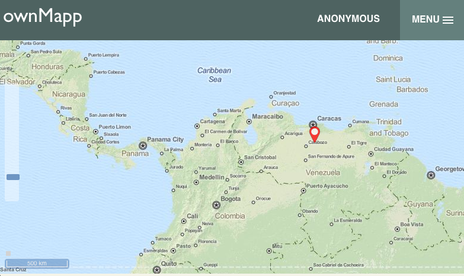
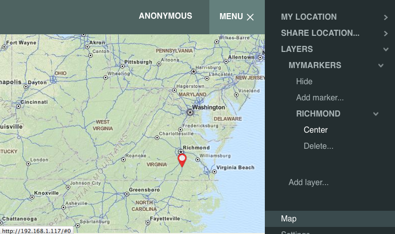

# ownMapp

The long-term goal of the ownMapp project is to provide an open-source web app for private, self-hosted geolocation services. Currently the ownMapp client app leverages OpenLayers 3 for the mapping tools and rendering and Backbone for the JavaScript framework; SQLite3 provides the database on the server side.

